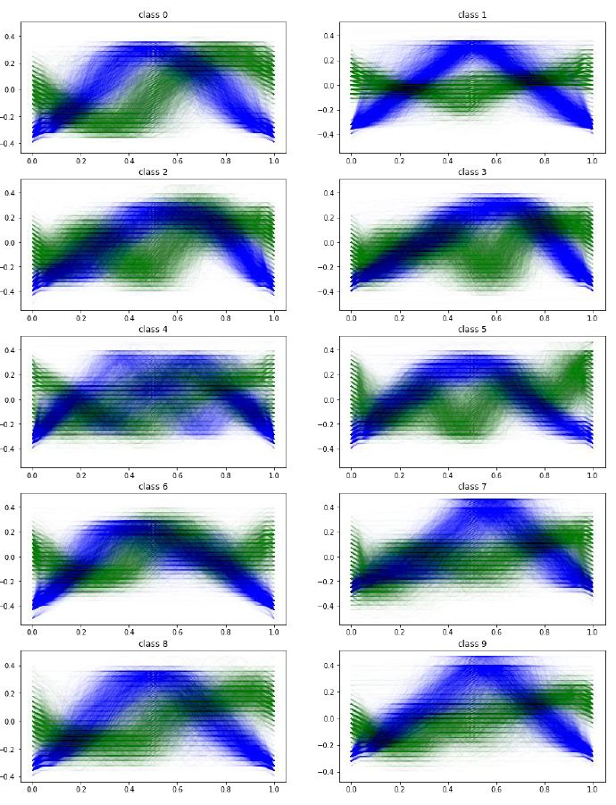
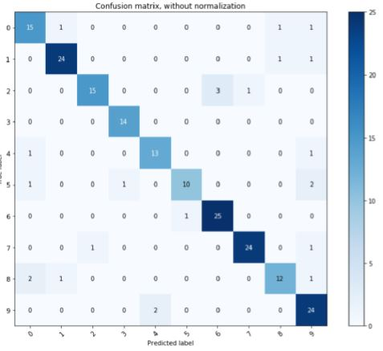

# DTW based MNIST Classifier
## Environment
- **Windows 10**
- **Python 3.6**
## Functional Description
- As a pretreatment process for given image data first, otsu binary is applied, then contours are extracted through a closing morphological operation and the longest contour signal is separated by signals for the X- and Y-axes. Based on the similarity of each signal, the DTW distance of each axis's contour signal within the learning data is calculated, and a classifier is created to search for the least value data based on the square root of each axis and to select the label of the data as the predicted value of the test sample.
### Contour Signal Plot
- It is a plot that shows patterns of 20,000 learning data extracted through pre-processing process. In response to this test data, the most similar pattern is chosen as the predicted value.

## Conclusion
### Prediction Result
- As a result of comparing 200 test data with 30000 learning data, 176 data projections were successful and the overall forecast rate was 88%.

### Limits
- This program is very slow because all learning data must be retrieved when predicting new data because it is predicted through CPU-based search using only vision techniques. Redesigned programs based on GPU could be a little faster, but this is not a fundamental solution. If you need to design a different model that takes performance into account in the future, you should preferably avoid a search-style model.
